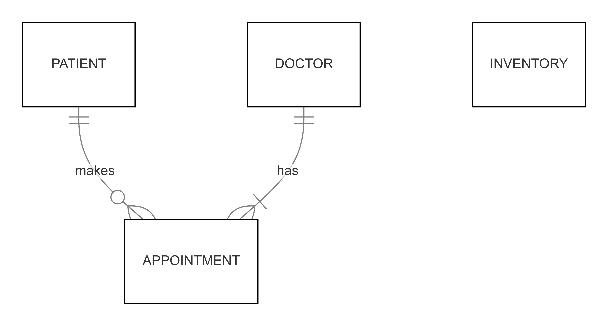

# Design Document

By Katherine Gilligan

Video overview: <https://youtu.be/vC_3Zngp928>

## Scope

This database is for the final project in CS50 SQL which aims to mimic a healthcare information system.

* What is the purpose of your database?
The purpose of this database is to mimic a healthcare information system for the fictional medical center "Gilly Gooms Center". This database will be useful in retaining patient information, doctor availablity, setting appointment times, and seeing if medicine is available at the pharmacy to be prescribed. I hope to complete this project so that it can translate well to a data analyst role in the future.

* Which people, places, things, etc. are you including in the scope of your database?
In the scope of this project, there will be a designated table for the following:
    * Patient: name, age, sex, phone number, insurance, pharmacy
    * Appointment: appointment date, status of appointment, foreign keys (patient & doctor)
    * Inventory: available/unavailable, item name
    * Doctor: name, speciality, availability

* Which people, places, things, etc. are *outside* the scope of your database?
Out of scope elements include, but are not limited to, the following:
    * Diagnosis: previous conditions, current ailments, family history
    * Billing: credit card information, copay/amount owed, payment status, billing date
    * Pharmacy: as of now, only the pharmacy name will be listed. In this iteration, it is assumed all medication is coming from the same overarching facility, however, an expanded database should include inventory for each pharmacy & check availability based on quantity.
* Note: a good addition in future iterations would be to CREATE TRIGGER once inventory table is expanded. The trigger should change the quantity of an item based on patients picking up prescriptions.

## Functional Requirements

* What should a user be able to do with your database?
A user should be able to aid a patient in making an appointment with a particular doctor and help the patient see if their medication is available or not.

* What's beyond the scope of what a user should be able to do with your database?
A user will be unable to see previous medical history, billing, and specific pharmacy inventories. As of now, this database is considering the user to be a worker at Gilly Gooms Center. In the future, for the final project in CS50x, the project will expand to a patient portal app where the patient can book appointments themselves.

## Representation

### Entities

The database includes the following entities:

### Patients

The `patient` table includes:
* `id`, this specifies the unique ID for a patient as an `INTEGER`. This column has the `PRIMARY KEY` constraint applied.
* `first_name` this specifies the first name of the patient as `TEXT`.
* `last_name` this specifies the last name of the patient as `TEXT`.
* `age` this specifies the age of the patient as `NUMERIC`.
* `birth_date` this specifies the birth date of the patient as `NUMERIC`.
* `patient_sex` this specifies the sex of the patient as `TEXT`. The string is checked to be either `male` or `female`.
* `home_address` this specifies the home address of the patient as `TEXT`.
* `phone_number` this specifies the phone number of the patient as `NUMERIC`.
* `insurance_provider` this specifies the insurance provider of the patient as `TEXT`.
* `pharmacy` this specifies the pharmacy name of the patient as `TEXT`.

* All columns in the `patient` table are required and therefore have the `NOT NULL` constraint applied.

### Appointments

The `appointment` table includes:
* `id`, this specifies the unique ID for an appointment as an `INTEGER`. This column has the `PRIMARY KEY` constraint applied.
* `patient_id` this specifies the patient ID who made an appointment as an `INTEGER`. This column has the `FOREIGN KEY` constraint applied, referencing the `id` column in the `patient` table. This ensures each appointment references back to the patient.
* `doctor_id` this specifies the doctor ID who has an appointment as an `INTEGER`. This column has the `FOREIGN KEY` constraint applied, referencing the `id` column in the `doctor` table. This ensures each appointment references back to the doctor.
* `appointment_date` this specifies the date and time of the appointment as `DATETIME`. This constraint gives both the date and the time.
* `appointment_status` this specifies the status of the appointment as `TEXT`. The string is checked to be one of the following: `upcoming`, `completed`, `canceled`, `rescheduled`.

*  All columns in the `appointment` table are required and therefore have the `NOT NULL` constraint applied.

### Inventory

The `inventory` table includes:
* `id`, this specifies the unique ID for an item as an `INTEGER`. This column has the `PRIMARY KEY` constraint applied.
* `item_name` this specifies the name of the medication that would be prescribed as `TEXT`.
* `availability` this specifies if the item is available or not as `TEXT`. The string is checked to be either `available` or `unavailable`.

*  All columns in the `inventory` table are required and therefore have the `NOT NULL` constraint applied.

### Doctors

The `doctor` table includes:
* `id`, this specifies the unique ID for a doctor as an `INTEGER`. This column has the `PRIMARY KEY` constraint applied.
* `first_name` this specifies the first name of the doctor as `TEXT`.
* `last_name` this specifies the last name of the doctor as `TEXT`.
* `specialty` this specifies the specialization of the doctor as `TEXT`.
* `schedule_date` this specifies the dates the doctor has available for appointments as `TEXT`.
* `schedule_time` this specifies the times the doctor has available for appointments as `NUMERIC`.

*  All columns in the `doctor` table are required and therefore have the `NOT NULL` constraint applied.

### Relationships

The below entity relationship diagram describes the relationships among the entities in the database.

As detailed in the diagram:

* One patient is capable of making 0 to many appointments. 0, if they have yet to make an appointment, and many if they are making multiple appointments. A patient can make multiple appointments with one doctor or multiple appointments with many doctors.
* One doctor is capable of having 0 to many appointments. 0, if they currently have no appointments for Gilly Gooms Center, and many if they have multiple appointments with patients. The doctor can have multiple appointments scheduled with one patient or multiple appointments scheduled with multiple patients.
* Inventory remains alone as of now. In a future iteration, it can be connected with a billing table.

## Optimizations

* Indexes: this feature utilizes data in order to speed up time. It is common for patient name, doctor availability, and appointments to be checked in this database. For this reason an index is made for the following:
    * `patient_name_search` which creates an index for the `first_name` and `last_name` of the patient in the `patient` table.
    * `doctor_availability` which creates an index for the `schedule_date` and `schedule_time` of the doctor in the `doctor` table.
    * `appointment_availability` which creates an index for the `appointment_date` and `appointment_status` in the `appointment` table.

* Views: this feature allows specific columns from tables to be combined so a user can access data more easily. This can also be useful for a healthcare information system since it can add a layer of security for the patients. Users might only be given access to specific views in order to hide personal information. The following view was developed:
    * `upcoming_appointment` this specifies the patient name, doctor name, and appointment date and time. The view uses the `first_name` and `last_name` from the `patient` table, the `first_name` and `last_name` from the `doctor` table, and the `appointment_date` from the `appointment` table. This view created the column names `patient first name`, `patient last name`, `appointment date`, `doctor first name` and `doctor last name` for user ease.

## Limitations

* The current schema assumes all medication comes from the same overarching facility. Multiple pharmacies and billing would require a `CREATE TRIGGER` to keep track of inventory and one-to-many relationship between patient and inventory.
